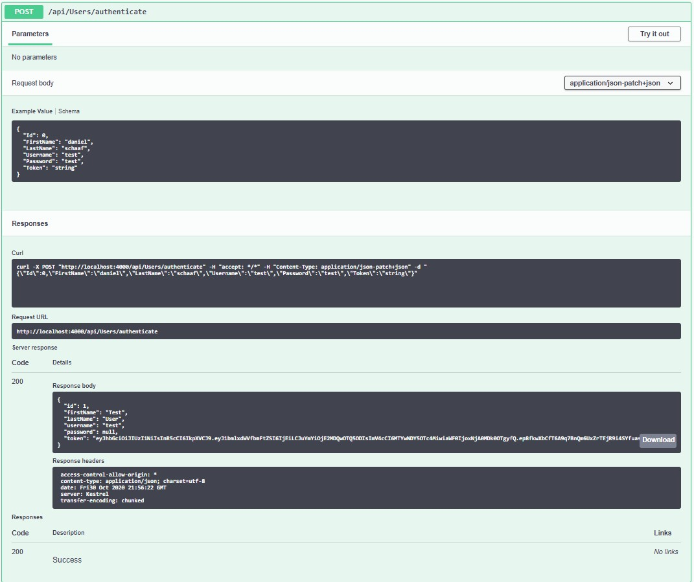
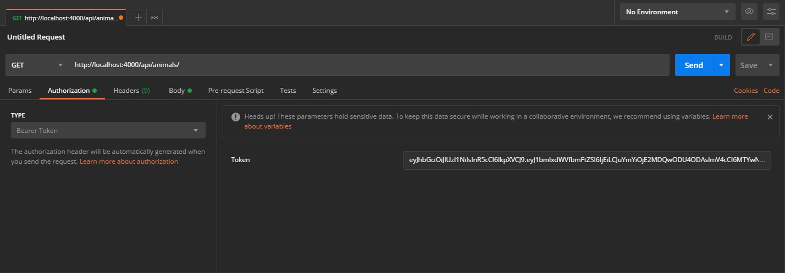
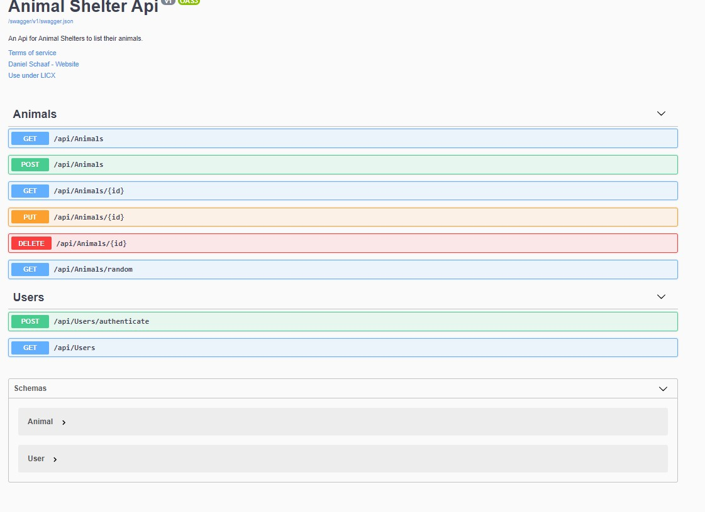

<br>
<p align="center">
  <u><big> <b>AnimalShelterAPI</b> </big></u>
</p>
<p align="center">
    <!-- Project Avatar/Logo -->
    <br>
     <a href="https://github.com/dschaaf89">
        
    </a>
    </a>
    <p align="center">
      ___________________________
    </p>
    <!-- GitHub Link -->
    <p align="center">
        <a href="https://github.com/dschaaf89">
            <strong>Daniel Schaaf</strong>
        </a>
    </p>
    <!-- Project Shields -->
    <p align="center">
        <a href="https://github.com/dschaaf89/AnimalShelterApi/graphs/contributors">
            
        </a>
        ¨
        <a href="https://github.com/dschaaf89/AnimalShelterApi/stargazers">
            
        </a>
        ¨
        <a href="https://github.com/dschaaf89/AnimalShelterApi/issues">
            
        </a>
        ¨
        <a href="https://github.com/dschaaf89/AnimalShelterApi/blob/master/LICENSE.txt">
            
        </a>
        ¨
        <a href="https://linkedin.com/in/danielschaaf">
            
        </a>
    </p>
</p>
<p align="center">
  <small>Initiated 10/30/2020.</small>
</p>
<p align="center">
    <a href="https://github.com/dschaaf89/AnimalShelterApi"><big>Project Docs</big></a> ·
    <a href="https://github.com/dschaaf89/AnimalShelterApi/issues"><big>Report Bug</big></a> ·
    <a href="https://github.com/dschaaf89/AnimalShelterApi/issues"><big>Request Feature</big></a>
</p>

------------------------------
### <u>Table of Contents</u>
* <a href="#🌐-about-the-project">About the Project</a>
    * <a href="#📖-description">Description</a>
    * <a href="#🦠-known-bugs">Known Bugs</a>
    * <a href="#🛠-built-with">Built With</a>
    <!-- * <a href="#🔍-preview">Preview</a> -->
* <a href="#🏁-getting-started">Getting Started</a>
    * <a href="#📋-prerequisites">Prerequisites</a>
    * <a href="#⚙️-setup-and-use">Setup and Use</a>
* <a href="#🛰️-api-documentation">API Documentation</a>
* <a href="#🤝-contributors">Auxiliary</a>
    * <a href="#🤝-contributors">Contributors</a>
    * <a href="#✉️-contact-and-support">Contact</a>
    * <a href="#⚖️-license">License</a>
    * <a href="#🌟-acknowledgements">Acknowledgements</a>
    
------------------------------
## 🌐 About the Project

### 📖 Description
This project was to build an Api for a Animal Shelter. it utilizes RESTful principles,enables Cors,and Has JWT Authentication protocols to make it so that only an Administrator can add,edit,delete entries. The basic user is able to use the basic functions of pulling the list of animals and searching utilizing animalType,age and sex as search parameters. they can also ask for a random animal to be pulled from the api. 

### 🦠 Known Bugs
There are no Known bugs with the system at this time. if you do find a bug please contact by submitting an issue ticket or emailing me at daniel.schaaf@outlook.com

### 🛠 Built With
* [Visual Studio Code](https://code.visualstudio.com/)
* [C#](https://docs.microsoft.com/en-us/dotnet/csharp/)
* [ASP.NET Core MVC](https://docs.microsoft.com/en-us/aspnet/core/mvc/overview?view=aspnetcore-3.1)
* [MySQL 8.0.20 ](https://dev.mysql.com/)
* [Entity Framework Core 2.2.6](https://docs.microsoft.com/en-us/ef/core/)
* [Swagger - NSwag 13.3.0](https://docs.microsoft.com/en-us/aspnet/core/tutorials/getting-started-with-nswag?view=aspnetcore-3.1&tabs=visual-studio)
* [Postman](postman.com)


## 🏁 Getting Started

### 📋 Prerequisites

#### Install .NET Core
* On macOS Mojave or later
  * [Click here](https://dotnet.microsoft.com/download/thank-you/dotnet-sdk-2.2.106-macos-x64-installer) to download the .NET Core SDK from Microsoft Corp for macOS.
* On Windows 10 x64 or later
  * [Click here](https://dotnet.microsoft.com/download/thank-you/dotnet-sdk-2.2.203-windows-x64-installer) to download the 64-bit .NET Core SDK from Microsoft Corp for Windows.

#### Install dotnet script
 Enter the command ``dotnet tool install -g dotnet-script`` in Terminal for macOS or PowerShell for Windows.

#### Install MySQL Workbench
 [Download and install the appropriate version of MySQL Workbench](https://dev.mysql.com/downloads/workbench/).

#### Install Postman
(Optional) [Download and install Postman](https://www.postman.com/downloads/).
#### Code Editor

  To view or edit the code, you will need an code editor or text editor. The popular open-source choices for an code editor are Atom and VisualStudio Code.

  1) Code Editor Download:
     * Option 1: [Atom](https://nodejs.org/en/)
     * Option 2: [VisualStudio Code](https://www.npmjs.com/)
  2) Click the download most applicable to your OS and system.
  3) Wait for download to complete, then install -- Windows will run the setup exe and macOS will drag and drop into applications.
  4) Optionally, create a [GitHub Account](https://github.com)

  #### Cloning

  1) Navigate to the [Animal Shelter API Repository here](https://github.com/dschaaf89/AnimalShelterApi).
  2) Click 'Clone or download' to reveal the HTTPS url ending with .git and the 'Download ZIP' option.
  3) Open up your system Terminal or GitBash, navigate to your desktop with the command: `cd Desktop`, or whichever location suits you best.
  4) Clone the repository to your desktop: `$ git clone https://github.com/dschaaf89/AnimalShelterApi.git`
  5) Run the command `cd AnimalShelterApi.Solution` to enter into the project directory.
  6) View or Edit:
      * Code Editor - Run the command `atom .` or `code .` to open the project in Atom or VisualStudio Code respectively for review and editing.
      * Text Editor - Open by double clicking on any of the files to open in a text editor.
  #### AppSettings

  1) Create a new file in the AnimalShelterApi.Solution/AnimalShelterApi directory named `appsettings.json`
  2) Add in the following code snippet to the new appsettings.json file:
  
  ```
{
    "Logging": {
        "LogLevel": {
        "Default": "Warning"
        }
    },
    "AllowedHosts": "*",
    "ConnectionStrings": {
        "DefaultConnection": "Server=localhost;Port=3306;database=Animal_Shelter;uid=root;pwd=YourPassword;"
    }
}
  ```
  3) Change the server, port, and user id as necessary. You can name your database anything you want just make sure there is a underscore _ in it or no spaces in the name and replace 'YourPassword' with relevant MySQL password (set at installation of MySQL).

  #### Database
  1) Navigate to AnimalShelterApi.Solution/AnimalShelterApi directory using the MacOS Terminal or Windows Powershell (e.g. `cd Desktop/AnimalShelterApi.Solution/AnimalShelterApi`).
  2) Run the command `dotnet ef database update` to generate the database through Entity Framework Core.
  3) (Optional) To update the database with any changes to the code, run the command `dotnet ef migrations add <MigrationsName>` which will use Entity Framework Core's code-first principle to generate a database update. After, run the previous command `dotnet ef database update` to update the database.
  #### Launch the API
  1) Navigate to AnimalShelterApi.Solution/AnimalShelterApi directory using the MacOS Terminal or Windows Powershell (e.g. `cd Desktop/AnimalShelterApi.Solution/AnimalShelterApi`).
  2) Run the command `dotnet run` to have access to the API in Postman or browser.
## 🛰️ API Documentation
Explore the API endpoints in Postman or a browser. You will not be able to utilize authentication in a browser.

### Using Swagger Documentation 
To explore the Animal Shelter Api with NSwag, launch the project using `dotnet run` with the Terminal or Powershell, and input the following URL into your browser: `http://localhost:4000/index.html`

### Using the JSON Web Token
In order to be authorized to use the POST, PUT, DELETE functionality of the API, please authenticate yourself through Postman.
* Open Postman and create a POST request using the URL: `http://localhost:4005/api/users/authenticate`
* Add the following query to the request as raw data in the Body tab:
```
{
    "UserName": "test",
    "Password": "test"
}
```
* The token will be generated in the response. Copy and paste it as the Token parameter in the Authorization tab. example of Swagger execution documentation for this is below.



### Postman Bearer Token Set up to use endpoints
In order to be authorized to use the POST, PUT, DELETE functionality of the API, please authenticate yourself through Postman.
After you get your token, got to Authorization tab in postman and click on Type dropdown and scroll down to BearerToken. Enter your Token into the Token space and your good to then use the POST, PUT, DELETE functionality of the API. 



### Note on CORS
CORS is a W3C standard that allows a server to relax the same-origin policy. It is not a security feature, CORS relaxes security. It allows a server to explicitly allow some cross-origin requests while rejecting others. An API is not safer by allowing CORS.
For more information or to see how CORS functions, see the [Microsoft documentation](https://docs.microsoft.com/en-us/aspnet/core/security/cors?view=aspnetcore-2.2#how-cors).

..........................................................................................

#### HTTP Request Structure
```
GET /api/animals
POST /api/animals
GET /api/animals/{id}
PUT /api/animals/{id}
DELETE /api/animals/{id}
GET/api/animals/random

```

#### Example Query
```
https://localhost:5000/api/animals/1
```

#### Sample JSON Response
```
{
  "animalId": 1,
  "animalType": "Cat",
  "breed": "Main Coon",
  "animalName": "Roger",
  "age": 3,
  "sex": "Male",
  "details": "Roger is a Large Orange Main Coon cat that is fixed and shots are current. would be great with a family that has kids."
}

```

..........................................................................................

### Endpoints
Base URL: `https://localhost:4000/index.html`





#### HTTP Request Structure
```
GET /api/animals
POST /api/animals
GET /api/animals/{id}
PUT /api/animals/{id}
DELETE /api/animals/{id}
GET /api/animals/random
```

#### Example Query
```
https://localhost:5000/api/animals/1
```

#### Sample JSON Response
```
{
  "animalId": 1,
  "animalType": "Cat",
  "breed": "Main Coon",
  "animalName": "Roger",
  "age": 3,
  "sex": "Male",
  "details": "Roger is a Large Orange Main Coon cat that is fixed and shots are current. would be great with a family that has kids."
}
```

..........................................................................................
#### HTTP Request
```
GET /api/animals
POST /api/animals
GET /api/animals/{id}
PUT /api/animals/{id}
DELETE /api/animals/{id}

GET /api/animals/random

```

#### Path Parameters
| Parameter | Type | Default | Required | Description |
| :---: | :---: | :---: | :---: | --- |
| filter | string | none | true | Return any animal from a specific animal type and sex. |
| filter |  int | none | true | Return any animal within the age parameters. if younger then 2 it will display all animals under two. if older it will display all animals older then search parameter |

#### Example Query
```
https://localhost:5000/api/reviews?animalType=Cat
```

#### Sample JSON Response
```
{
  "animalId": 1,
  "animalType": "Cat",
  "breed": "Main Coon",
  "animalName": "Roger",
  "age": 3,
  "sex": "Male",
  "details": "Roger is a Large Orange Main Coon cat that is fixed and shots are current. would be great with a family that has kids."
},
{
  "animalId": 3,
  "animalType": "Cat",
  "breed": "tabby",
  "animalName": "Skittles",
  "age": 7,
  "sex": "female",
  "details": "Skittles is an older female cat that would do well in a small family with older kids, She is best by herself and has never been around dogs."
}
```

..........................................................................................

------------------------------

### 🤝 Contributors

| Author | GitHub | Email |
|--------|:------:|:-----:|
| [Daniel Schaaf](https://linkedin.com/in/danielschaaf) | [dschaaf89](https://github.com/dschaaf89) |  [Daniel.schaaf@outlook.com](mailto:Daniel.schaaf@outlook.com) |


------------------------------

### ✉️ Contact and Support

If you have any feedback or concerns, please contact one of the contributors.

------------------------------

### ⚖️ License

This project is licensed under the [MIT License](https://opensource.org/licenses/MIT). Copyright (C) 2020 Daniel Schaaf. All Rights Reserved.
```
MIT License

Copyright (c) 2020 **_Daniel Schaaf_**

Permission is hereby granted, free of charge, to any person obtaining a copy
of this software and associated documentation files (the "Software"), to deal
in the Software without restriction, including without limitation the rights
to use, copy, modify, merge, publish, distribute, sublicense, and/or sell
copies of the Software, and to permit persons to whom the Software is
furnished to do so, subject to the following conditions:

The above copyright notice and this permission notice shall be included in all
copies or substantial portions of the Software.

THE SOFTWARE IS PROVIDED "AS IS", WITHOUT WARRANTY OF ANY KIND, EXPRESS OR
IMPLIED, INCLUDING BUT NOT LIMITED TO THE WARRANTIES OF MERCHANTABILITY,
FITNESS FOR A PARTICULAR PURPOSE AND NONINFRINGEMENT. IN NO EVENT SHALL THE
AUTHORS OR COPYRIGHT HOLDERS BE LIABLE FOR ANY CLAIM, DAMAGES OR OTHER
LIABILITY, WHETHER IN AN ACTION OF CONTRACT, TORT OR OTHERWISE, ARISING FROM,
OUT OF OR IN CONNECTION WITH THE SOFTWARE OR THE USE OR OTHER DEALINGS IN THE
SOFTWARE.
```

------------------------------

### 🌟 Acknowledgments

#### [Epicodus](https://www.epicodus.com/)
>"A school for tech careers... to help people learn the skills they need to get great jobs."

#### [The Internet](https://lh3.googleusercontent.com/proxy/6QlFHq-RHi9-Jd7pjdpwFdWMTYy5y26LesKZG-TO7rD3ZCh2BESLUzktpd27TAXSiGd19f8B3AxMn5Nbos1g6QCHAQOTrvVsAVnqS7RKSCQLV6s)
> "...The Internet is becoming the town square for the global village of tomorrow..."
> - Bill Gates

------------------------------

<center><a href="#">Return to Top</a></center>